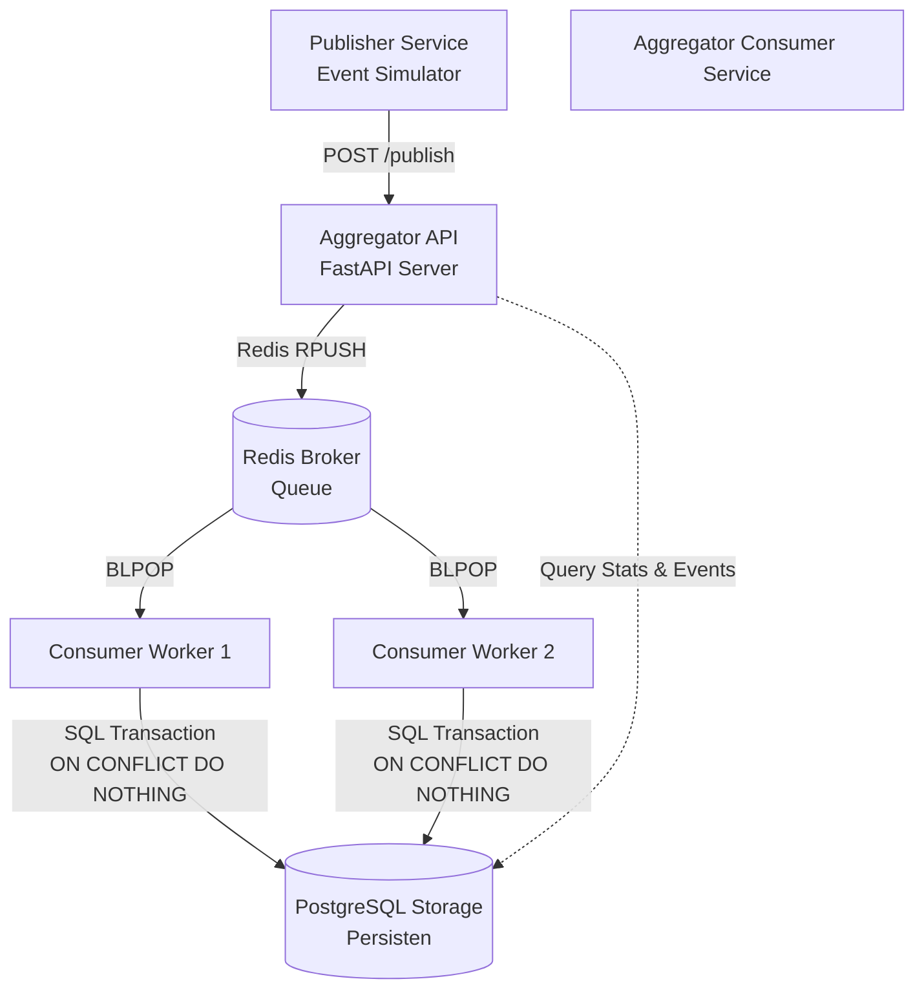

# UAS Sistem Paralel dan Terdistribusi
**Tema**: Pub-Sub Log Aggregator Terdistribusi dengan Idempotent Consumer, Deduplication, dan Transaksi/Kontrol Konkurensi

## 1. Arsitektur Sistem

Sistem ini dirancang sebagai log aggregator terdistribusi menggunakan arsitektur event-driven Pub-Sub yang toleran terhadap kegagalan, handal, dan menjamin konsistensi data yang kuat (deduplikasi & idempotensi) meskipun di bawah beban kerja yang tinggi.



> [!NOTE]
> Visualisasi diagram alur kerja sistem lengkap juga dapat diakses secara langsung pada berkas gambar: **[system_flow.png](file:///D:/sister-uas/system_flow.png)**.
> 

### Komponen Utama:
1. **[Publisher](file:///D:/sister-uas/publisher/publisher.py)**: Generator log telemetry yang mensimulasikan transmisi data dengan model *at-least-once delivery* (mengirimkan data normal beserta duplikasi minimum 30% untuk menguji sistem deduplikasi).
2. **[Aggregator API](file:///D:/sister-uas/aggregator/app/api/endpoints.py)**: Menyediakan REST API endpoint berbasis FastAPI untuk menerima log secara single maupun batch, memvalidasi skema data, meningkatkan metrik log masuk, dan memasukkannya ke dalam antrean broker.
3. **[Redis Broker](file:///D:/sister-uas/docker-compose.yml)**: Berfungsi sebagai message broker perantara untuk meredam lonjakan trafik log (load leveling) dan mendistribusikan log kepada worker.
4. **[Consumer Worker](file:///D:/sister-uas/aggregator/app/worker/consumer.py)**: Layanan latar belakang (bisa diskalakan banyak instance) yang menarik data dari Redis antrean secara FIFO dan memasukkannya ke database secara transaksional.
5. **[PostgreSQL Database](file:///D:/sister-uas/aggregator/app/core/database.py)**: Penyimpanan persisten dengan constraint unik `(topic, event_id)` yang mengontrol konkurensi data menggunakan mekanisme Upsert atomik untuk mencegah race condition.

---

## 2. API Endpoints

### `POST /publish`
Menerima event log tunggal maupun batch, memvalidasi kesesuaian skema, mencatat statistik log masuk, lalu memasukannya ke antrean broker Redis.
* **Payload Format (Single)**:
  ```json
  {
    "topic": "system.auth",
    "event_id": "evt_73a9856db89",
    "timestamp": "2026-06-16T15:57:09Z",
    "source": "auth-service",
    "payload": {
      "user_id": 42,
      "status": "success"
    }
  }
  ```
* **Response**: `202 Accepted`
  ```json
  {
    "status": "enqueued",
    "count": 1
  }
  ```

### `GET /events?topic=<topic_name>`
Mengembalikan semua event log yang unik dan telah diproses pada topik tertentu.
* **Response**: `200 OK`
  ```json
  [
    {
      "topic": "system.auth",
      "event_id": "evt_73a9856db89",
      "timestamp": "2026-06-16T15:57:09+00:00",
      "source": "auth-service",
      "payload": {
        "user_id": 42,
        "status": "success"
      }
    }
  ]
  ```

### `GET /stats`
Menyediakan metrik operasional secara real-time yang dihitung secara transaksional dan bebas dari lost-update.
* **Response**: `200 OK`
  ```json
  {
    "received": 20000,
    "unique_processed": 14000,
    "duplicate_dropped": 6000,
    "topics": ["system.auth", "payment.process"],
    "uptime": 34
  }
  ```

### `GET /health/liveness` & `/health/readiness`
Digunakan oleh orkestrator (seperti Docker Compose) untuk memonitor kesehatan dan kesiapan konektivitas API dengan broker (Redis) dan database (PostgreSQL).

---

## 3. Cara Menjalankan Sistem

### Persyaratan Awal:
* Docker & Docker Compose terinstal di komputer.
* Python 3.11 (jika ingin menjalankan unit/integration test secara lokal tanpa kontainer).

### Langkah-langkah Pengoperasian:

1. **Jalankan Layanan (Build & Up)**:
   Perintah ini akan melakukan build image Docker secara lokal untuk API aggregator dan Publisher simulator, lalu menyalakan semua service (database, broker, consumer, api, dan simulator):
   ```bash
   docker compose up --build
   ```

2. **Skalakan Consumer Worker (Opsional - Demo Multi-worker)**:
   Untuk membuktikan kontrol konkurensi di bawah beban paralel, Anda dapat menyalakan beberapa instance consumer worker sekaligus:
   ```bash
   docker compose up --build --scale aggregator-consumer=3
   ```

3. **Verifikasi Jalannya Simulasi**:
   Setelah container berjalan, simulator `publisher` secara otomatis mengirimkan **20.000 event log** dengan **30% duplikasi** ke `aggregator-api`. Anda dapat melihat konsol output container untuk melihat visualisasi performa throughput dan rata-rata latensi:
   ```bash
   docker logs publisher
   ```

4. **Bersihkan Container dan Volume**:
   Untuk mematikan container dan membersihkan storage:
   ```bash
   docker compose down -v
   ```

---

## 4. Cara Menjalankan Unit & Integration Tests

Sistem ini dilengkapi dengan 17 skenario pengujian komprehensif menggunakan `pytest` yang memvalidasi integritas skema log, toleransi duplikasi, liveness/readiness, ketahanan crash, serta ketahanan terhadap race conditions.

### Skenario Pengujian Lokal:
1. Pastikan docker-compose sedang berjalan (`docker compose up`).
2. Instal dependensi testing di komputer lokal Anda:
   ```bash
   pip install -r tests/requirements.txt
   ```
3. Jalankan script testing otomatis:
   ```bash
   python tests/run_tests.py
   ```
   *Script ini akan memverifikasi kesiapan API sebelum mengeksekusi pytest secara otomatis.*

---

## 5. Pengujian Kinerja & Observabilitas (Ekspor Laporan JSON)

Layanan simulator `publisher` dikonfigurasi untuk merekam data transaksi secara real-time dan mengekspor hasilnya langsung ke folder lokal host Anda (melalui volume mount kontainer) saat simulasi selesai dijalankan:

* **[report.json](file:///D:/sister-uas/report.json)**: Berisi ringkasan metrik akhir dari seluruh durasi simulasi pengujian (total throughput, requests, rates, latency min/max/avg/p95/p99).
* **[realtime-report.json](file:///D:/sister-uas/realtime-report.json)**: Berisi jejak log realtime JSON-Lines per request yang menunjukkan aliran timestamp, metode HTTP, status kode respons, dan waktu latensi tiap event log.

Berkas laporan ini secara otomatis tergenerasi di root folder direktori kerja Anda setiap kali kontainer `publisher` menyelesaikan pengujian beban 20.000 event log.

---

## 6. Struktur Berkas Repositori
* **[docker-compose.yml](file:///D:/sister-uas/docker-compose.yml)**: Orkestrasi seluruh arsitektur microservices terdistribusi.
* **[aggregator/](file:///D:/sister-uas/aggregator)**: Direktori kode program log aggregator.
  * **[Dockerfile](file:///D:/sister-uas/aggregator/Dockerfile)**: Docker build spec untuk aggregator.
  * **[app/](file:///D:/sister-uas/aggregator/app)**: Source code aplikasi aggregator terstruktur.
    * **[api/endpoints.py](file:///D:/sister-uas/aggregator/app/api/endpoints.py)**: Controller endpoints REST API (FastAPI).
    * **[core/database.py](file:///D:/sister-uas/aggregator/app/core/database.py)**: Inisialisasi tabel, connection pool database, dan query SQL.
    * **[core/config.py](file:///D:/sister-uas/aggregator/app/core/config.py)**: Variabel konfigurasi terpusat.
    * **[worker/consumer.py](file:///D:/sister-uas/aggregator/app/worker/consumer.py)**: Logika background consumer antrean Redis.
* **[publisher/](file:///D:/sister-uas/publisher)**: Layanan simulator beban log.
  * **[publisher.py](file:///D:/sister-uas/publisher/publisher.py)**: Simulator log dengan multi-concurrency generator.
  * **[Dockerfile](file:///D:/sister-uas/publisher/Dockerfile)**: Docker build spec untuk simulator.
* **[tests/](file:///D:/sister-uas/tests)**: Skenario integration & unit testing.
  * **[test_1_health.py](file:///D:/sister-uas/tests/test_1_health.py)**: Pengujian endpoint healthcheck (Liveness/Readiness).
  * **[test_2_schema.py](file:///D:/sister-uas/tests/test_2_schema.py)**: Pengujian validasi skema payload log (Pydantic).
  * **[test_3_publish.py](file:///D:/sister-uas/tests/test_3_publish.py)**: Pengujian penerimaan & pemrosesan event (Tunggal & Batch).
  * **[test_4_deduplication.py](file:///D:/sister-uas/tests/test_4_deduplication.py)**: Pengujian ketahanan deduplikasi & Idempotent Consumer.
  * **[test_5_query.py](file:///D:/sister-uas/tests/test_5_query.py)**: Pengujian kueri pencarian & penyaringan log berdasarkan topik.
  * **[test_6_concurrency.py](file:///D:/sister-uas/tests/test_6_concurrency.py)**: Pengujian perlombaan kondisi konkuren (Race Conditions).
  * **[test_7_stress.py](file:///D:/sister-uas/tests/test_7_stress.py)**: Pengujian beban stres & analisis latensi ingestion.
  * **[run_tests.py](file:///D:/sister-uas/tests/run_tests.py)**: Otomatisasi pemicu testing.
* **[report.md](file:///D:/sister-uas/report.md)**: Dokumen Laporan Teori UAS (Menjawab Soal T1-T10 dengan Sitasi APA 7th).
* **[report.pdf](file:///D:/sister-uas/report.pdf)**: Dokumen Laporan Teori UAS versi PDF resmi.
* **[system_flow.png](file:///D:/sister-uas/system_flow.png)**: Visualisasi diagram alur sistem terdistribusi.